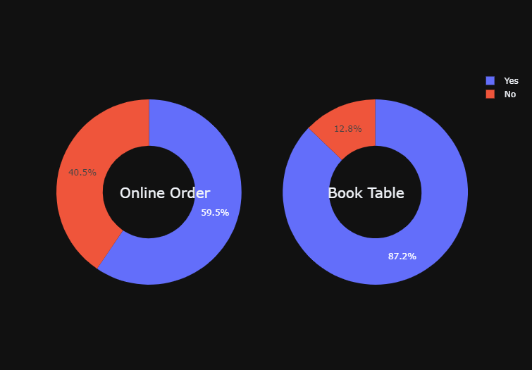
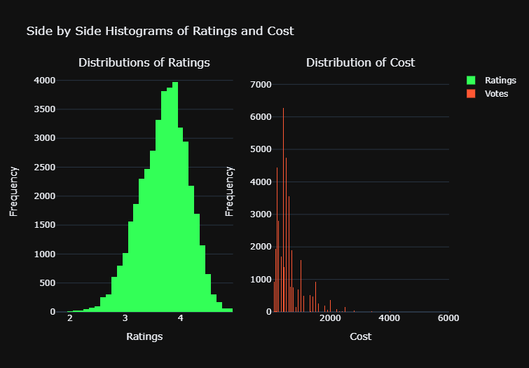
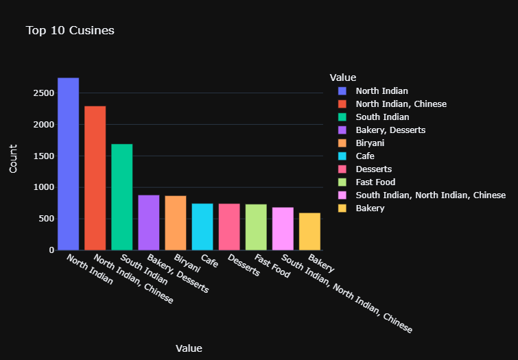

# Zomato-Ratings-Prediction
# Project Overview:-
* Build a Web Application to predict Zomato Ratings for your Restaurant in Banglaore.
* Bangalore being one such city has more than 12,000 restaurants with restaurants serving dishes from all over the world.  It  has become difficult for new restaurants to compete with established restaurants.
* Analysed Features like which are responsible to predict Ratings like:-Location,Price,Cuisine etc and prepared a model that can predict ratings for restaurants given features.
* Build an API using flask
# Features used for Prediction:-
* Online Order:- whether online ordering is available in the restaurant or not
* Book Table:-   table book option available or not
* Votes:-        contains total number of rating for the restaurant as of the today's date
* Location:-     contains the neighborhood in which the restaurant is located
* Rest Type:-    Type of Restaurant
# EDA:-
Looked at different plots to better understand the data. Some of plots from analysis:-

